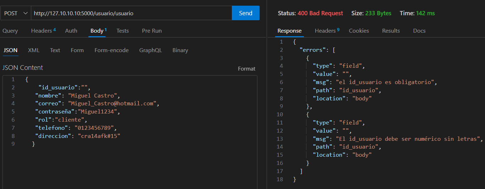
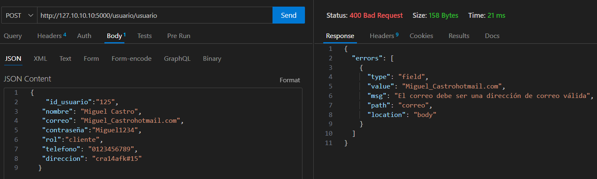
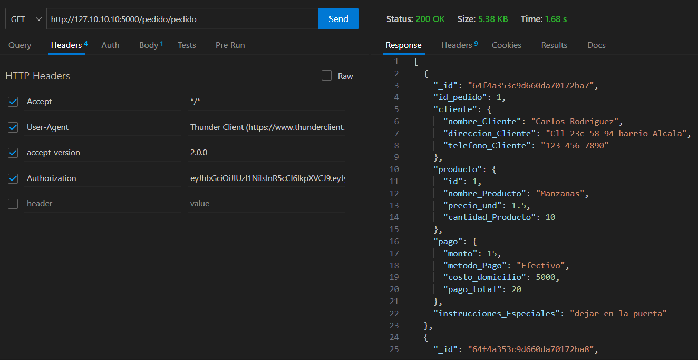

# Funcionamiento De Rappi

### ¿Que es Rappi?

Rappi es una empresa que facilita a las personas el adquirir un producto o servicio.

### Servicios que maneja Rappi:

### Mercado:

Este servicio ayuda en la conveniencia y ahorro en tiempo y dinero, ya que en rappi se puede realizar un mercado completo.

### Restaurantes:

La idea es que a través de este servicio se pueda pedir a todos los restaurantes de la zona en la que se encuentra una persona.

### Rappicash:

En cuanto a nuestro servicio de Rappicash, buscamos llevarte el efectivo que necesites a donde	quieras.

### Farmacia y Bienestar:

En cuanto al servicio de Farmacia, la idea es que te compremos los medicamentos que necesites.

# Funcionamiento De Una Aplicación Para Delivery

### **1. Registro y creación de perfiles:**

Los usuarios entran en contacto con la app a través de la página deregistro. Esta es la razón por la cual el registro debería serrápido y fácil, pidiendo únicamente los  detalles necesarios. La mayoría de las apps de reparto a domicilio utilizan email, contraseña y teléfono hacen uso de Google o Facebook SDK.

### **2. Busquedade servicios:**

losusuarios tienen acceso a un catálogo de restaurantes o servicios, con respecto a esto es bueno agregar una opción de búsqueda por navegación. Los clientes suelen buscar los sitios donde realizar un pedido mediante el nombre del establecimiento, localización o menú.

### **3. Pedidos:**

Losusuarios deberían ser capaces de agregar al carrito en dos clics, y de la misma manera poder editar sus pedidos o eliminarlos. Luego, poder acceder al resumen de la compra, dónde se incluyen detalles del pedido que debería ser confirmada por los usuarios antes de realizar un pago.

### **4. Pagos:**

Empieza ofreciendo 2 o 3 métodos de pago y cuando tu negocio crezca siempre podrás agregar más de ser necesarios. Si los usuarios han agregado detalles sobre sus métodos de pago previamente, permíteles elegir esta opción al momento de realizar el pago.

### 5. Seguimiento de pedidos:

La característica de  seguimiento ayuda a los usuarios a sabcomida Laer cuando sus pedidos van a llegar. El seguimiento de pedidos a través del repartidor es ejecutado con un Location API ofrecido por Google ( Android ) o CoreLocationFramework ( iOS ). Ambos ayudan a establecer la localización del repartidor que permitirá a la aplicación mostrar el tiempo de entrega aproximado.

### 6. Notificaciones:

Losclientes ocupados ( los cuales son tu cliente objetivo ) no tienen tiempo para hacer un seguimiento de sus pedidos. Por eso es necesario informarles sobre el estado de su pedido ( Realizada, En progreso, En camino, Entregada ). Puede hacerse a través de notificaciones push o por mensajes de texto y suele funcionar a la perfección. Solo asegúrate de enviar notificaciones importantes.

### 7. Valoración y reviews:

La mejor manera que tienen los usuarios para compartir sus experiencias espectaculares es  darla mayor puntuación en la escala de valoración o escribir una reseña. Haz que los usuarios se involucren ofreciéndoles la posibilidad de evaluar los servicios de delivery, el tiempo de espera y la comida La sección de reviews dejará que tú y los propietarios del restaurante puedan saber si hay algún problema con el personal o la calidad de la comida.

### 8. Historial de pedidos:

Una lista de los pedidos previos es otra funcionalidad que mejora la experiencia del usuario. Al poder acceder al historial de pedidos los clientes pueden encontrar fácilmente los nombres de los platos que más les han gustado y pueden pedirlos de nuevo.

# Opciones de posibles proyectos:

* **Gestión de Órdenes y Entregas:**

Crea rutas y controladores para que los usuarios puedan realizar pedidos, seleccionar productos, establecer direcciones de entrega y hacer seguimiento del estado de sus pedidos. Utiliza tokens para asegurarte de que solo los usuarios autenticados puedan realizar pedidos y acceder a la información de seguimiento.

* **Gestión de Usuarios y Autenticación:**

Utiliza tokens y middlewares para implementar la autenticación y autorización de usuarios. Puedes permitir a los usuarios registrarse, iniciar sesión y administrar sus perfiles. Esto también incluye la gestión de roles y permisos, lo que garantiza que solo los usuarios autorizados puedan acceder a ciertas funciones.

* **Gestión de Pagos:**

Extiende el ejemplo de la parte de pago para procesar transacciones seguras y confiables. Utiliza tokens y middlewares para autenticar y autorizar a los usuarios a realizar pagos. Almacenar los detalles de la transacción en MongoDB te permitirá llevar un registro de las transacciones realizadas.

* **Gestión de Productos y Menús:**

Crea una estructura para gestionar los productos disponibles en la plataforma, incluidos detalles como nombres, descripciones, precios y categorías. Los usuarios pueden navegar y seleccionar productos para agregar a sus pedidos.

* **Gestión de Impuestos y Facturación:**

Desarrolla una función que permita a los restaurantes y usuarios generar facturas y llevar un registro de los impuestos aplicados a las transacciones.

# **Bibliografías:**

### Link información de Rappi

[https://blog.rappi.com/que-es-rappi/](https://blog.rappi.com/que-es-rappi/)

### Link información de aplicacion para Delivery

[https://estudioalfa.com/por-que-deberias-tener-tu-propia-app-de-reparto-domicilio](https://estudioalfa.com/por-que-deberias-tener-tu-propia-app-de-reparto-domicilio)

## Investigación Github Ramas (branch)

##### **Git branch:**

La funcionalidad de las ramas de Git te permite crear nuevas ramas de un proyecto para probar ideas, aislar nuevas características, o experimentar sin impactar al proyecto principal.

##### **Ver Ramas:**

Para ver las ramas en un repositorio Git, ejecuta el comando:

```shell
git branch
```

Habrá un asterisco (*) junto a la rama en la que te encuentras actualmente.

##### **Cambiar de Rama**

Para moverse a una rama existente, ejecuta el comando:

```shell
git checkout NOMBRE-RAMA
```

Hay un atajo para crear y moverte a la nueva rama al mismo tiempo.:

```shell

git checkout -b NOMBRE-NUEVA-RAMA
```

##### **Renombrar una Rama**

Para renombrar una rama, ejecutar el comando:

```shell
git branch -m VIEJO-NOMBRE-RAMA NUEVO-NOMBRE-RAMA
```

##### **Eliminar una Rama**

Git no te permitirá eliminar una rama en la que te encuentres actualmente. Primero necesitas moverte a una rama diferente, y luego ejecutar el comando:

```shell
git branch -d RAMA-A-ELIMINAR
```

no se puede eliminar la rama donde se encuentra ubicado el asterisco

##### **Comparar Ramas**

Puedes comparar ramas con el comando `git diff`:

```shell
git diff PRIMERA-RAMA..SEGUNDA-RAMA
```

Verás resultados en color para los cambios entre ramas. Para todas las líneas que han cambiado, la versión de `SEGUNDA-RAMA` será una línea verde comenzando con un "+", y la versión de `PRIMERA-RAMA` será una línea roja comenzando con un "-".

##### **Ayuda con Ramas de Git**

Si olvidas cómo utilizar una opción, o quieres explorar otra funcionalidad alrededor del comando `git branch`, puedes ejecutar cualquiera de estos comandos:

```shell
git help branch
git branch --help
man git-branch
```

##### Git Merge

El comando `git merge` fusionará cualquier cambio que se haya hecho en la base de código en una rama separada de tu rama actual como un nuevo commit.

La sintaxis del comando es la siguiente:

```shell
git merge NOMBRE-DE-LA-RAMA
```

##### Abandonar todos los cambios

```shell
git reset --hard        # remueve todos los cambios pendientes
```

## ¿Cómo realizar un release en github?

1. **Crear una versión del código:**
   * Asegúrate de que todos los cambios que deseas incluir en el lanzamiento estén confirmados y fusionados en la rama principal (por ejemplo, `main` o `master`).
   * Puedes realizar cambios menores, correcciones de errores o mejoras antes de crear un lanzamiento.
2. **Ir a la sección "Releases" del repositorio:**
   * Ve al repositorio en GitHub.
3. **Crear un nuevo lanzamiento:**
   * En la parte superior del repositorio, haz clic en la pestaña "Releases".
   * Luego, haz clic en el botón "Nuevo lanzamiento" o "Draft a new release".
4. **Llenar los detalles del lanzamiento:**
   * Asigna un "Tag version" (etiqueta de versión) a tu lanzamiento. Por lo general, las etiquetas de versión siguen un formato semántico como "v1.0.0". Esta etiqueta debe coincidir con la versión del código que estás lanzando.
   * Escribe un título descriptivo para el lanzamiento.
   * Puedes agregar una descripción más detallada del lanzamiento en el campo "Descripción".
5. **Adjuntar archivos o enlaces (opcional):**
   * Si deseas proporcionar archivos binarios, instaladores, documentación u otros archivos junto con el lanzamiento, puedes arrastrar y soltar los archivos en la sección "Arrastra y suelta archivos aquí para agregarlos al lanzamiento" o hacer clic en "subir archivos".
   * También puedes agregar enlaces a recursos externos relevantes para el lanzamiento.
6. **Publicar el lanzamiento:**
   * Una vez que hayas llenado los detalles y agregado los archivos o enlaces deseados, haz clic en el botón "Publicar lanzamiento" (o "Publish release").
   * Si no estás listo para publicar el lanzamiento de inmediato, puedes guardar un borrador del lanzamiento haciendo clic en "Guardar borrador" (o "Save draft").
7. **Notificar y compartir:**
   * Después de publicar el lanzamiento, puedes compartir el enlace del lanzamiento con otros miembros del equipo, usuarios o interesados para que puedan acceder a los archivos, la información y las notas del lanzamiento.

## Asignacion de tareas en Notion:

1. **Crear una Base de Datos:**

   * En tu página de Notion, crea una base de datos que se utilizará para hacer un seguimiento de las tareas asignadas. Para hacer esto, puedes hacer clic en "Agregar una página" y seleccionar "Base de datos".
   * Configura las propiedades de la base de datos según tus necesidades. Puedes incluir propiedades como "Nombre de la tarea", "Asignado a", "Fecha límite", "Estado".
2. **Agregar Entradas (Tareas):**

   * Agrega entradas a la base de datos para representar las tareas que deseas asignar. Rellena la información relevante en las propiedades que has configurado, como el nombre de la tarea, la persona asignada y la fecha límite.
3. **Asignar Tareas:**

   * En la propiedad "Asignado a", puedes usar el formato "@nombre-de-usuario" para mencionar a la persona a la que deseas asignar la tarea. Notion incluso te proporcionará sugerencias de nombres mientras escribes.
4. **Colaboración y Notificaciones:**

   * Cuando asignas una tarea a una persona utilizando la propiedad "Asignado a", Notion puede notificar automáticamente a esa persona si has compartido la página o la base de datos con ellos. También pueden recibir notificaciones por correo electrónico si tienen esta configuración habilitada.
5. **Realizar Seguimiento y Actualizar el Estado:**

   * A medida que se trabaja en una tarea, puedes actualizar el estado en la propiedad correspondiente. Por ejemplo, puedes tener propiedades como "En progreso", "Completada", "Pendiente", etc.
6. **Personalización Adicional:**

   * Puedes personalizar aún más tu base de datos añadiendo vistas como tablas, tableros, calendarios, galerías, etc., para tener diferentes formas de visualizar y gestionar las tareas asignadas.
7. **Recordatorios y Fechas Límite:**

   * Puedes configurar recordatorios y fechas límite en la propiedad "Fecha límite" para que tú y los asignados sean notificados antes de que se venza una tarea.
8. **Seguimiento y Filtrado:**

   * Utiliza funciones de búsqueda y filtrado en la base de datos para rastrear tareas asignadas, ver el estado, filtrar por persona asignada, etc.

   **Ejemplo:**

Bibliografia:

[https://www.freecodecamp.org/espanol/news/explicacion-de-la-rama-de-gi-como-eliminar/]()

[https://keepcoding.io/blog/que-es-la-rama-release-en-git/#:~:text=La%20rama%20release%20en%20Git%20se%20define%20como%20un%20tipo,determinada%20fecha%20de%20publicaci%C3%B3n%20estipulada.]()

[https://www.notion.so/help/tasks-and-dependencies]()

## **Descripción del Proyecto: Aplicación de Delivery con Express y Node.js**

El proyecto es una aplicación de delivery basada en Node.js que utiliza el framework Express para crear un servidor. El objetivo principal de esta aplicación es recrear las funcion básica de una plataforma de delivery, permitiendo la gestión de usuarios (clientes y repartidores), restaurantes, productos, órdenes, pedidos y roles a través de una base de datos. El enfoque se pone en la seguridad, la validación de datos y la gestión eficiente de peticiones.

#### **Características:**

1. **Servidor Express:** El proyecto comienza configurando un servidor utilizando Express, facilitando la creación de rutas y el manejo de peticiones.
2. **Base de Datos:** Se integra una base de datos NoSQL con MongoDB. Se crean colecciones para cada entidad del sistema: usuario, restaurante, pedido, producto, rol y orden.
3. **Autenticación y Autorización:** Se implementa un sistema de autenticación y autorización utilizando JSON Web Tokens (JWT), bcrypt y middlewares de Express. Se verifican los tokens para asegurar que solo los usuarios autenticados y autorizados puedan acceder a rutas específicas.
4. **Gestión de Roles:** Se asignan roles a los usuarios (cliente, repartidor, administrador etc.) y se utilizan middlewares para restringir el acceso a ciertas rutas basado en los roles asignados.
5. **Limitación de Peticiones:** Se implementa un mecanismo para limitar la cantidad de peticiones que un usuario puede hacer en un determinado período de tiempo. Esto evita abusos o ataques de fuerza bruta.
6. **Encriptado de contraseñas:** se utiliza la libreria bcrypt para la proteccion de datos.
7. **Validación de Datos de Entrada:** Se utiliza un enfoque de Transferencia de Objeto de Datos (DTO) para validar y procesar los datos de entrada. Esto garantiza que los datos ingresados en las solicitudes POST sean coherentes y cumplan con los requisitos del sistema.
8. **Manejo de Versiones:** Se utiliza el encabezado "Accept-Version" en las solicitudes para manejar versiones de la API de manera efectiva. Esto permite realizar cambios y actualizaciones en la API sin afectar a los clientes existentes.
9. **Funcionalidades de Delivery:** Se implementan rutas y controladores para permitir a los usuarios crear órdenes, ver restaurantes y productos, realizar seguimiento de pedidos, etc.

**Flujo de Trabajo Típico:**

1. Un usuario inicia sesión utilizando sus credenciales. Se genera un JWT después de una autenticación exitosa.
2. El usuario accede a diversas rutas dependiendo de su rol, como realizar un pedido, administrar productos o creación de clientes.
3. Antes de acceder a rutas protegidas, los middlewares verifican la validez del token y el rol del usuario para garantizar el acceso autorizado.

# **Pasos para Configurar y Usar la Aplicación:**

***1. Clonar el Repositorio:*** Clona este repositorio en tu máquina local usando el comando:

```
git clone https://github.com/DiegoMartinez2094/rappi_campus.git
```

***2. Instalar Dependencias:*** Asegúrate de tener Node.js instalado en este caso se manejó el proyecto en la v18.16.0. Luego, desde la raíz del proyecto, ejecuta el siguiente comando para instalar las dependencias:

```
npm install
```

***3. Configurar Variables de Entorno:*** Abre el archivo `.env.example` y verifica las variables de entorno necesarias para la conexión al servidor y a la base de datos en Atlas. Asegúrate de proporcionar los valores correctos para `My_server`, `ATLAS_USER`, `ATLAS_PASSWORD` y `ATLAS_DB`. y quita .example que el nombre del archivo sea solo `.env`

***4. Conectar la Base de Datos:*** Para conectar la base de datos utilizando la extensión "MongoDB for VS Code":

* Abre la extensión y selecciona "Connect". Se te pedirá el enlace de conexión de la base de datos que encontrarás en tu página de Atlas.
* Ingresa el enlace de la forma:

  ```
  mongodb+srv://<nombreusuario>:<password>@cluster0.<subdominio>.mongodb.net/
  ```
* Reemplaza `nombreusuaio, password y subdominio`
* Una vez conectado, ejecuta el archivo `db/base_datos.mongodb` haciendo clic en el botón "Mongo Run" en la esquina superior derecha.

***5.Iniciar archivo:*** Ejecutamos el archivo `app.js` mediante el siguiente comando en la terminal:

```
npm run dev
```

Nos dará un mensaje similar a este: `Servidor iniciado en http://127.10.10.10:5011` que nos indica la direccion url donde está corriendo el servidor.

## Utilización de la APP:

Nota: Para la validación utilizaremos la erramienta Extension de Visual Estudio: ThunderClient,

1-Se debe crear un usuario con el metodo post y la direccion http://127.10.10.10:5000/usuario/usuario y los datos en el body todos son obligatorios:

```
 {
    "id_usuario":20,
   "nombre": "Miguel Castro",
   "correo": "Miguel_Castro@hotmail.com",
   "contraseña":"Miguel1234",
   "rol":"cliente",
   "telefono": "0123456789",
   "direccion": "cra14afk#15"
  }
```

**Tener en cuenta que en el rol solo podrás poner "repartidor" o "cliente" sin modificaciones con mayusculas.**

Si hay algun error en los datos ingresados, se mostrará el erro al costado derecho, ejemplo :

intentamos no poner el id_usuario:



Intentamos no poner una dirección de correo correcta :



Así con todas las colecciones obtendremos errores en caso de datos erroneos

**Terner en cuenta que si hay un usuario con el mismo correo previamente registrado, no dejará registrar con el mismo correo y saldrá el siguiente mensaje:  "message": "Correo registrado con anterioridad"**

para confirmar  debe salir el siguiente mensaje:  "message": **"Usuario creado con éxito"**

**2-Login, para ingresar debes solicitar un token mediante la solicitud get y la URL de la siguiente forma:**

**{puerto de conexion}/login/{correo}-{contraseña} ejemplo:**

```
http://127.10.10.10:5000/login/Miguel_Castro@hotmail.com-Miguel1234
```

Si se envia información por la Url no valida saldrá el siguiente mensaje: "mensaje": "Credenciales inválidas"

**si el usuario está previamente registrado, el token (duración 10 minutos) dará acceso a las respectivas colecciones y metodos especificos:**

si el tiempo del token caduca saldrá el siguiente mensaje: "mensaje": "Token inválido" tendrá que realizar denuevo el proceso de login

*Para el usuario "cliente": en las versiones 1.0.0 solo podrá hacer un get global, para la version 2.0.0 podrá realizar post, put por id*

| **metodo** | **coleccion**   | **url ejemplo**                            | version       |
| ---------------- | --------------------- | ------------------------------------------------ | ------------- |
| POST             | **pedido**      | http://127.10.10.10:5000/pedido/pedido           | 2.0.0         |
| PUT              | **pedido**      | http://127.10.10.10:5000/pedido/pedido/id_pedido | 2.0.0         |
| GET              | **pedido**      | http://127.10.10.10:5000/pedido/pedido           | 1.0.0 o 2.0.0 |
| DELETE           | **pedido**      | http://127.10.10.10:5000/pedido/pedido/id_pedido | 2.0.0         |
| GET              | **producto**    | http://127.10.10.10:5000/producto/producto       | 1.0.0 o 2.0.0 |
| GET              | **restaurante** | http://127.10.10.10:5000/restaurante/restaurante | 1.0.0 o 2.0.0 |

**Para realizar una solicitud ejemplo pedido: 	**

**Tener en cuenta que si un usuario intenta acceder a una coleccio a la que no tien permiso, saldrá el siguiente mensaje: "mensaje": "Acceso no autorizado a la colección"**

**si el usuario intenta acceder a un metodo al que no tiene permiso saldrá el siguiente mensaje: "mensaje": "Método no permitido para este rol y colección"**

1. Ingresamos la url=http://127.10.10.10:5000/pedido/pedido
2. Metodo tipo GET
3. En los headers: accept-version   2.0.0
4. En los headers: Authorization   (ingresamos el token generado anteriormente)

   De esta manera debería quedar la solicitud:

   

**Para el usuario "repartidor":**

| **metodo** | **coleccion** | **url ejemplo**                         | version |
| ---------------- | ------------------- | --------------------------------------------- | ------- |
| GET              | orden               | http://127.10.10.10:5000/orden/orden          | 1.0.0   |
| GET              | orden               | http://127.10.10.10:5000/orden/orden/id_orden | 2.0.0   |

para el usuario "administrador":

El administrador tiene acceso a todas las colecciones y a todos los metodos, excepto la coleccion rol.

para el usuario "Super_administrador" tiene acceso a todas las colecciones y a todos los metodos.

---

**Ejemplos de colecciones:**

Ejemplo de restaurante:

```
{id_Restaurante: 150,nombre_Restaurante: "Delicias del Mar", telefono_Restaurante: "1234569877", direccion_Restaurante: "Calle de los Sabores 123",calificacion_Restaurante: 4,
  }
```

Ejemplo producto:

```
{id_Producto: 150,nombre_Producto: "Manzanas",descripcion_Producto: "Frescas manzanas rojas de temporada",precio_und: 1500,
  }
```

ejemplo pedido:

```
 {
    id_pedido:150,
  cliente: { nombre_Cliente: "Carlos Rodríguez",direccion_Cliente: "Cll 23c 58-94 barrio Alcala",telefono_Cliente:"123-456-7890"},
  producto: { id: 1, nombre_Producto: "Manzanas",precio_und: 1.500, cantidad_Producto:10},
 pago: { monto: 15.000, metodo_Pago: "Efectivo", costo_domicilio: 5000, pago_total: 20.000 },
instrucciones_Especiales:"dejar en la puerta",
  }
```


---

**DIagrama de la Base de datos:**

```
+----------------------+  
|      rol             |
+----------------------+
| Id_rol: int          |
| nombre_rol: string   |
| acceso_rol: object   |
+----------------------+ 

+------------------------------+
|    producto                  |
+------------------------------+
| id_Producto: int             |
| nombre_Producto: string      |
| descripcion_Producto: string |
| precio_und: int              |
+------------------------------+

+-------------------------------+
|   restaurante                 |
+-------------------------------+
| id_Restaurante: int           |
| nombre_Restaurante: string    |
| telefono_Restaurante: string  |
| direccion_Restaurante: string |
| calificacion_Restaurante: int |
+-------------------------------+

+----------------------------------+
|     pedido                       |
+----------------------------------+
| id_pedido: int                   |
| cliente: object                  |
| producto: object                 |
| pago:object                      |
| instrucciones_Especiales: string |
+----------------------------------+

+--------------------+
|     usuario        |
+--------------------+
| id_usuario: int    |
| nombre: string     |
| correo: string     |
| contraseña: string |
| rol: string        |
| telefono: string   |
| direccion: string  |
+--------------------+

+----------------------------------+
|     orden                        |
+----------------------------------+
| id_Orden: int                    |
| fecha_Creacion:date              |
| cliente:object                   |
| producto:object                  |
| pago: object                     |
| estado: string                   |
| instrucciones_Especiales: string |
| repartidor_Asignado: object      |
| fecha_Entrega: date              |
| calificacion: int                |
| restaurante: object              |
+----------------------------------+

```

---

**SEGURIDAD:**
La app cuenta con un sistema de encriptado de contraseñas para los usuarios, limitante de numero de solicitudes en un determinado tiempo (5 solicitudes en 30 segundos) cuando se supera el limite, saldrá el siguiente mensaje:**"message": "Limite alcanzado",** validador de datos tanto en la solicitud del metodo como en la base de datos.

**ERRORES:**
En caso de esperimentar algún error de conexión de este tipo : "Error: listen EADDRINUSE: address already in use 127.10.10.10:5000"
se debe ingresar al archivo .env y cambiar el puertoMy_server={"hostname":"127.10.10.10", "port":"**5000**"} es el numero que está en negrilla.

En caso de experimentar un error en el programa en general, se recomienda digitar el comando en la terminal Ctrl+C segudio de la letra s y la tecla Intro, de nuevo el comando npm run dev.

En caso de esperimentar otro tipo de errores ponerse en contacto con los desarrolladores.
